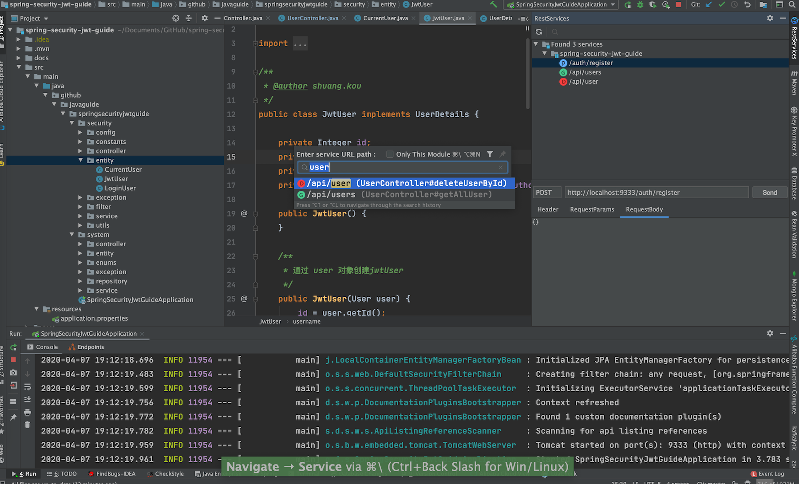
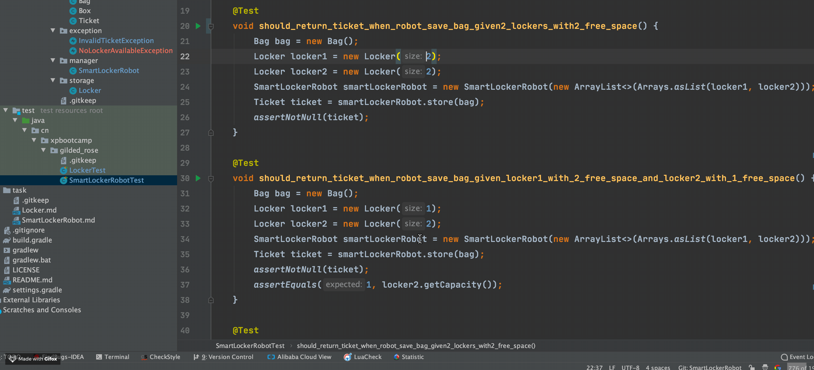
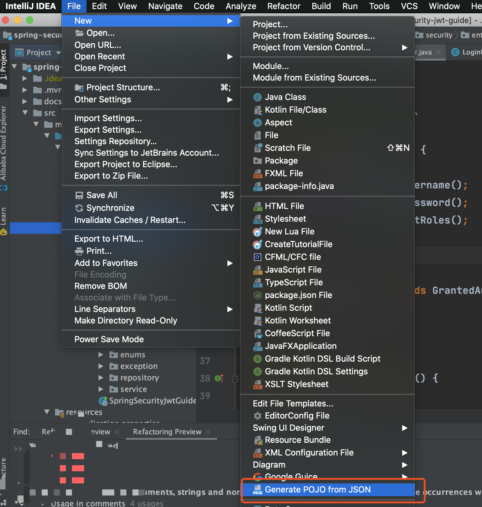

大家好，我是Guide哥，这篇文章中我会介绍10个非常不错的IDEA插件以及它们常见功能的使用方法。

>👉 **注意：这只是第一弹，后面的文章中，我会继续推荐一些我在工作中必备的 IDEA 插件以及他们的使用方法。**

**目录：**

<!-- TOC -->

- [IDE Features Trainer—IDEA交互式教程](#ide-features-traineridea%e4%ba%a4%e4%ba%92%e5%bc%8f%e6%95%99%e7%a8%8b)
- [RestfulToolkit—RESTful服务开发](#restfultoolkitrestful%e6%9c%8d%e5%8a%a1%e5%bc%80%e5%8f%91)
- [Key Promoter X—快捷键](#key-promoter-x%e5%bf%ab%e6%8d%b7%e9%94%ae)
- [Presentation Assistant—快捷键展示](#presentation-assistant%e5%bf%ab%e6%8d%b7%e9%94%ae%e5%b1%95%e7%a4%ba)
- [Codota—代码智能提示](#codota%e4%bb%a3%e7%a0%81%e6%99%ba%e8%83%bd%e6%8f%90%e7%a4%ba)
- [Alibaba Java Code Guidelines—阿里巴巴 Java 代码规范](#alibaba-java-code-guidelines%e9%98%bf%e9%87%8c%e5%b7%b4%e5%b7%b4-java-%e4%bb%a3%e7%a0%81%e8%a7%84%e8%8c%83)
- [GsonFormat+RoboPOJOGenerator—JSON转类对象](#gsonformatrobopojogeneratorjson%e8%bd%ac%e7%b1%bb%e5%af%b9%e8%b1%a1)
- [Statistic—项目信息统计](#statistic%e9%a1%b9%e7%9b%ae%e4%bf%a1%e6%81%af%e7%bb%9f%e8%ae%a1)
- [Translation-必备的翻译插件](#translation-%e5%bf%85%e5%a4%87%e7%9a%84%e7%bf%bb%e8%af%91%e6%8f%92%e4%bb%b6)
- [CamelCase-多种命名格式之间切换](#camelcase-%e5%a4%9a%e7%a7%8d%e5%91%bd%e5%90%8d%e6%a0%bc%e5%bc%8f%e4%b9%8b%e9%97%b4%e5%88%87%e6%8d%a2)

<!-- /TOC -->

### IDE Features Trainer—IDEA交互式教程

**有了这个插件之后，你可以在 IDE 中以交互方式学习IDEA最常用的快捷方式和最基本功能。** 非常非常非常方便！强烈建议大家安装一个，尤其是刚开始使用IDEA的朋友。	

当我们安装了这个插件之后，你会发现我们的IDEA 编辑器的右边多了一个“**Learn**”的选项，我们点击这个选项就可以看到如下界面。


我们选择“Editor Basics”进行，然后就可以看到如下界面，这样你就可以按照指示来练习了！非常不错！


### RestfulToolkit—RESTful服务开发

专为 RESTful 服务开发而设计的插件，有了它之后，你可以：

1.**根据 URL 直接跳转到对应的方法定义 (Windows: `ctrl+\` or `ctrl+alt+n`  Mac:`command+\` or `command+alt+n`  )并且提供了一个 Services tree 的可视化显示窗口。** 如下图所示:



**2.作为一个简单的 http 请求工具来使用。**


**4.在请求方法上添加了有用功能: 复制生成 URL、复制方法参数...**

我们选中的某个请求对应的方法然后右击，你会发现多了这样几个选项。我们选择`Generate & Copy Full URL`，这样你就把整个请求的路径复制下来了：`http://localhost:9333/api/users?pageNum=1&pageSize=1` 。


**5.其他功能: java 类上添加 Convert to JSON 功能，格式化 json 数据 ( Windows: Ctrl + Enter; Mac: Command + Enter )。**

我们选中的某个类对应的方法然后右击，你会发现多了这样几个选项。


当我们选择`Convert to JSON`的话，你会得到：

```json
{
  "username": "demoData",
  "password": "demoData",
  "rememberMe": true
}
```

### Key Promoter X—快捷键

相信我！这一定是IDEA必备的一个插件。**它的功能主要是在一些你本可以使用快捷键操作的地方提醒你用快捷键操作。** 比如我直接点击tab栏下的菜单打开 Version Control(版本控制) 的话，这个插件就会提示我说你可以用快捷键 `command+9`或者`shift+command+9`打开，如下图所示：


**除了这个很棒的功能之外，它还有一个功能我觉得非常棒，那就是展示出哪些快捷键你使用的次数最多！超级赞！！！**

*Guide哥：快捷键真的很重要！入职之后，每次看着同事们花里胡哨的快捷键操作，咔咔咔很快就完成了某个操作，我才深深意识到它的重要性。不夸张的说，你用IDEA开发，常用的快捷键不熟悉的话，效率至少降低 30%。*


小伙，你使用快捷键进行操作的时候，是帅啊！但是，你给别人演示的时候，别人可能根本不知道你进行了什么快捷键操作。这个时候 **Presentation Assistant** 这个插件就站出来了！

### Presentation Assistant—快捷键展示

安装这个插件之后，你用键盘快捷键所做的操作都会被展示出来，非常适合自己在录制视频或者给别人展示代码的时候使用。比如我使用快捷键 `command+9`打开 Version Control ，使用了这个插件之后的效果如下图所示：



### Codota—代码智能提示

Codota 这个插件用于智能代码补全，它基于数百万Java程序，能够根据程序上下文提示补全代码。相比于IDEA自带的智能提示来说，Codota 的提示更加全面一些,如下图所示。

我们使用`HttpUrlConnection ` 建立一个网络连接是真的样的：


我们创建线程池现在变成下面这样：


上面只是为了演示这个插件的强大，实际上创建线程池不推荐使用这种方式， 推荐使用 `ThreadPoolExecutor` 构造函数创建线程池。我下面要介绍的一个阿里巴巴的插件-**Alibaba Java Code Guidelines** 就检测出来了这个问题，所以，`Executors`下面用波浪线标记了出来。

**除了，在写代码的时候智能提示之外。你还可以直接选中代码然后搜索相关代码示例。**


Codota  还有一个在线网站，在这个网站上你可以根据代码关键字搜索相关代码示例，非常不错！我在工作中经常会用到，说实话确实给我带来了很大便利。网站地址：https://www.codota.com/code ，比如我们搜索 `Files.readAllLines`相关的代码，搜索出来的结果如下图所示：


Codota 插件的基础功能都是免费的。你的代码也不会被泄露，这点你不用担心。

### Alibaba Java Code Guidelines—阿里巴巴 Java 代码规范

阿里巴巴 Java 代码规范，对应的Github地址为：[https://github.com/alibaba/p3c](https://github.com/alibaba/p3c ) 。非常推荐安装！

安装完成之后建议将与语言替换成中文，提示更加友好一点。


根据官方描述：

> 目前这个插件实现了开发手册中的的53条规则，大部分基于PMD实现，其中有4条规则基于IDEA实现，并且基于IDEA [Inspection](https://www.jetbrains.com/help/idea/code-inspection.html)实现了实时检测功能。部分规则实现了Quick Fix功能，对于可以提供Quick Fix但没有提供的，我们会尽快实现，也欢迎有兴趣的同学加入进来一起努力。 目前插件检测有两种模式：实时检测、手动触发。

上述提到的开发手册也就是在Java开发领域赫赫有名的《阿里巴巴Java开发手册》。

你还可以手动配置相关 inspection规则：


这个插件会实时检测出我们的代码不匹配它的规则的地方，并且会给出修改建议。比如我们按照下面的方式去创建线程池的话，这个插件就会帮我们检测出来,如下图所示。


这个可以对应上 《阿里巴巴Java开发手册》 这本书关于创建线程池的方式说明。


### GsonFormat+RoboPOJOGenerator—JSON转类对象

这个插件可以根据Gson库使用的要求,将JSONObject格式的String 解析成实体类。

这个插件使用起来非常简单，我们新建一个类，然后在类中使用快捷键 `option + s`(Mac)或`alt + s` (win)调出操作窗口（**必须在类中使用快捷键才有效**），如下图所示。


这个插件是一个国人几年前写的，不过已经很久没有更新了，可能会因为IDEA的版本问题有一些小Bug。而且，这个插件无法将JSON转换为Kotlin（这个其实无关痛痒，IDEA自带的就有Java转Kotlin的功能）。 


另外一个与之相似的插件是 **：RoboPOJOGenerator** ，这个插件的更新频率比较快。

`File-> new -> Generate POJO from JSON`



然后将JSON格式的数据粘贴进去之后，配置相关属性之后选择“*Generate*”


### Statistic—项目信息统计

有了这个插件之后你可以非常直观地看到你的项目中所有类型的文件的信息比如数量、大小等等，可以帮助你更好地了解你们的项目。


你还可以使用它看所有类的总行数、有效代码行数、注释行数、以及有效代码比重等等这些东西。


### Translation-必备的翻译插件

有了这个插件之后，你再也不用在编码的时候打开浏览器查找某个单词怎么拼写、某句英文注释什么意思了。

并且，这个插件支持多种翻译源：

1. Google 翻译
2. Youdao 翻译
3. Baidu 翻译

除了翻译功能之外还提供了语音朗读、单词本等实用功能。这个插件的Github地址是：[https://github.com/YiiGuxing/TranslationPlugin](https://github.com/YiiGuxing/TranslationPlugin) （貌似是国人开发的，很赞）。

**使用方法很简单！选中你要翻译的单词或者句子，使用快捷键 `command+ctrl+u(mac)` / `shift+ctrl+y(win/linux)`** （如果你忘记了快捷的话，鼠标右键操作即可！）


**如果需要快速打开翻译框，使用快捷键`command+ctrl+i(mac)`/`ctrl + shift + o(win/linux)`**


如果你需要将某个重要的单词添加到生词本的话，只需要点击单词旁边的收藏按钮即可！

### CamelCase-多种命名格式之间切换

非常有用！这个插件可以实现包含6种常见命名格式之间的切换。并且，你还可以对转换格式进行相关配置（转换格式），如下图所示：


有了这个插件之后，你只需要使用快捷键 `shift+option+u(mac)` / `shift+alt+u` 对准你要修改的变量或者方法名字，就能实现在多种格式之间切换了，如下图所示：


如果你突然忘记快捷键的话，可以直接在IDEA的菜单栏的 Edit 部分找到。


使用这个插件对开发效率提升高吗？拿我之前项目组的情况举个例子：

我之前有一个项目组的测试名字是驼峰这种形式:`ShouldReturnTicketWhenRobotSaveBagGiven1LockersWith2FreeSpace` 。但是，使用驼峰形式命名测试方法的名字不太明显，一般建议用下划线_的形式：`should_return_ticket_when_robot_save_bag_given_1_lockers_with_2_free_space`

如果我们不用这个插件，而是手动去一个一个改的话，工作量想必会很大，而且正确率也会因为手工的原因降低。

> 👉 **注意：这只是第一弹，后面的文章中，我会继续推荐一些我在工作中必备的 IDEA 插件以及他们的使用方法。**

