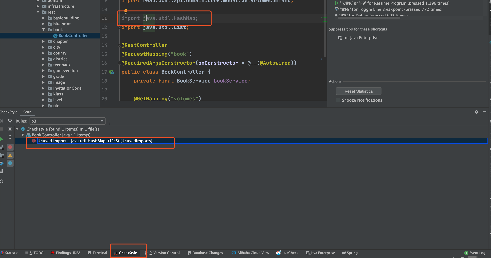

### CheckStyle—代码格式检查

这个插件的作用主要是为了规范代码格式比如说项目中一行代码最长是多少、项目中有没有无用的引用等等。非常实用！

一般情况下我们会在项目中配置 CheckStyle，并且自定义规则，然后再配置一个Commit 的 Git 钩子，这样我们在Commit代码的时候就会跑一遍 CheckStyle，看看项目代码的格式有问题不。

这个插件的作用主要是帮助我们定位问题，示例如下：

我们使用一个自定义的规则，然后运行 CheckStyle  ，可以看到这个插件就帮我们找到有一个无用的 import。

### 其他常用插件推荐

1. **leetcode editor** :提供在线 Leetcode 刷题功能，比较方便我们刷题，不过我试用之后发现有一些小 bug，个人感觉还是直接在网站找题目刷来的痛快一些。
2. 
