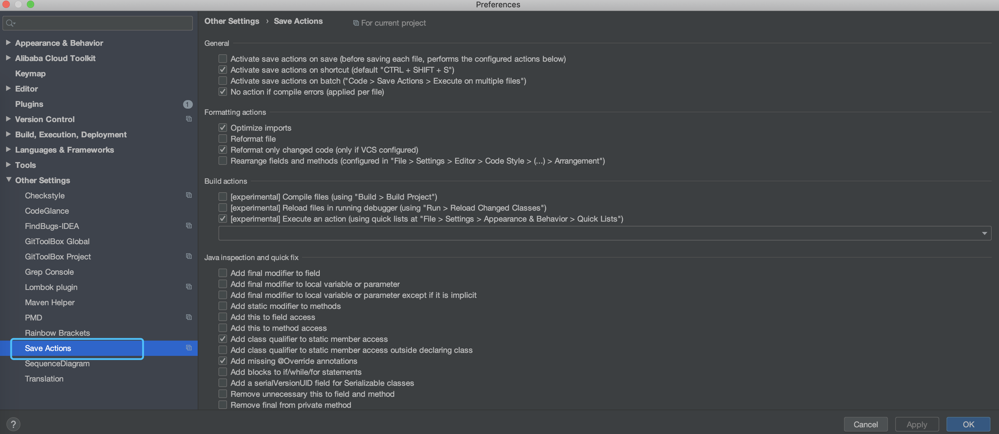
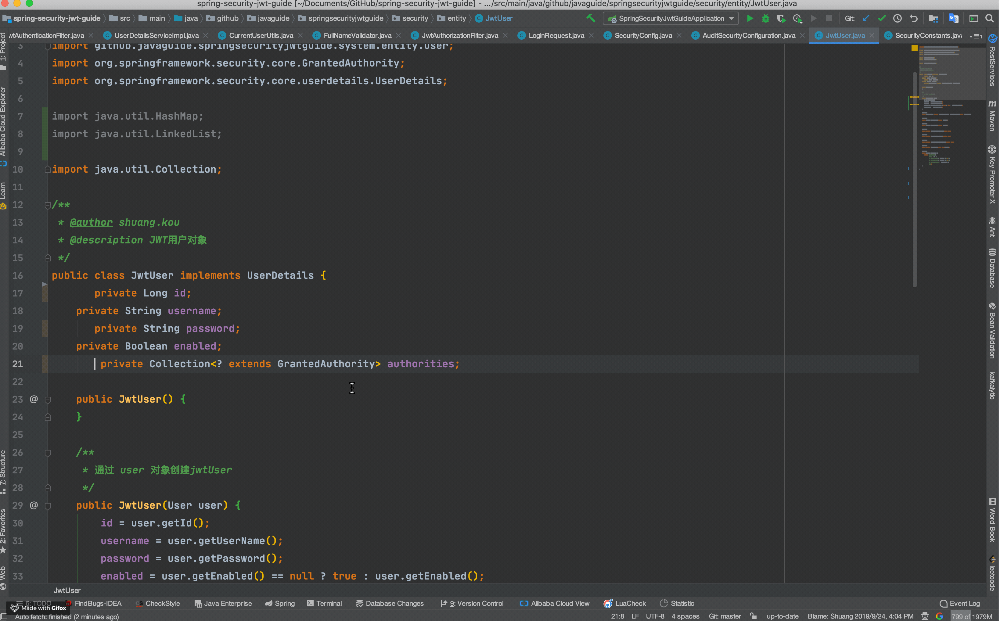
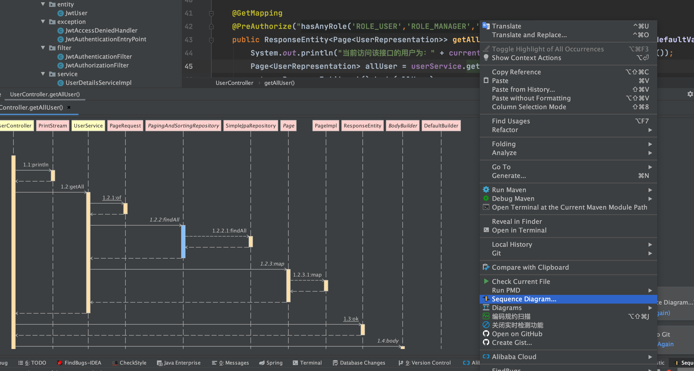
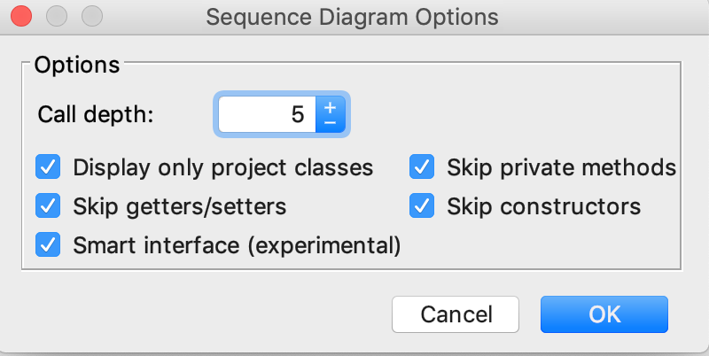
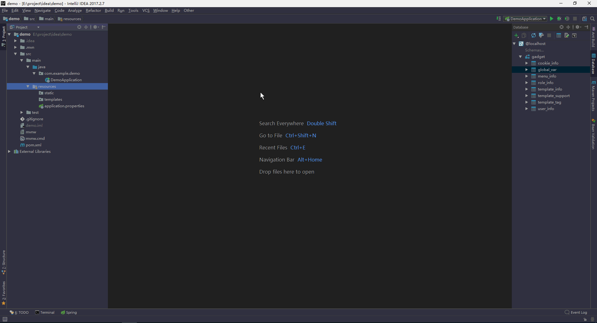
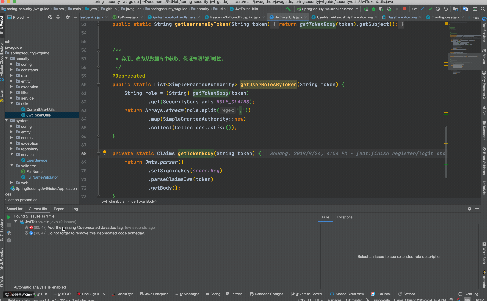
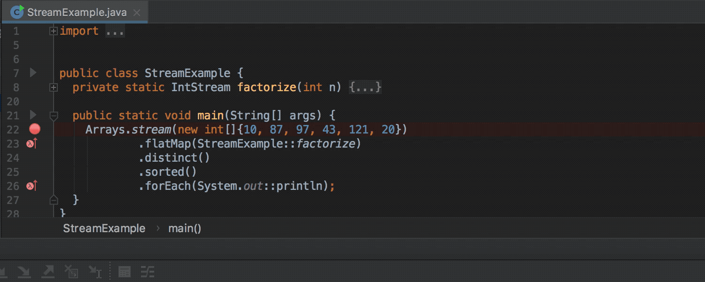
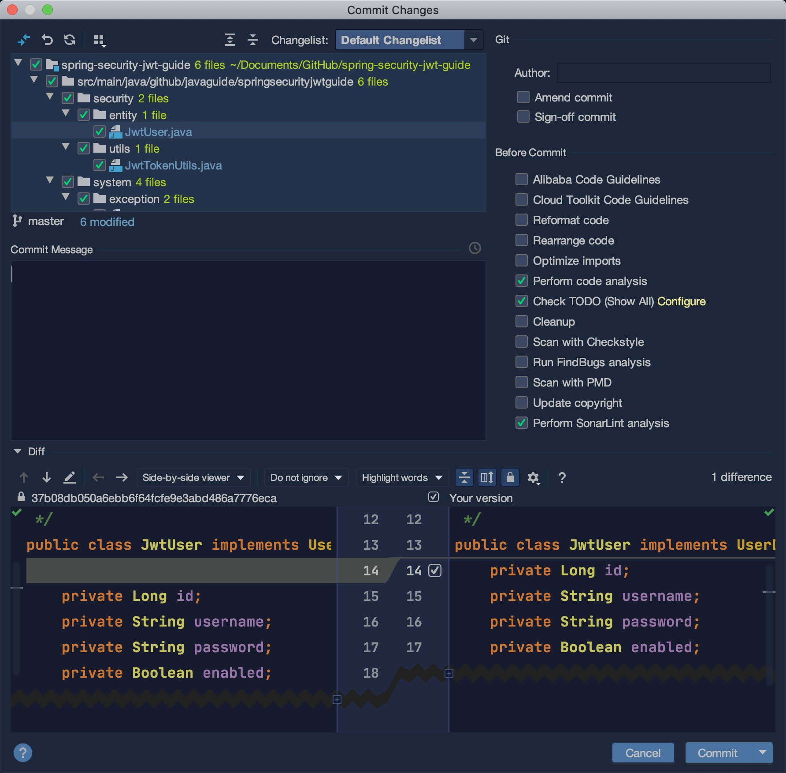
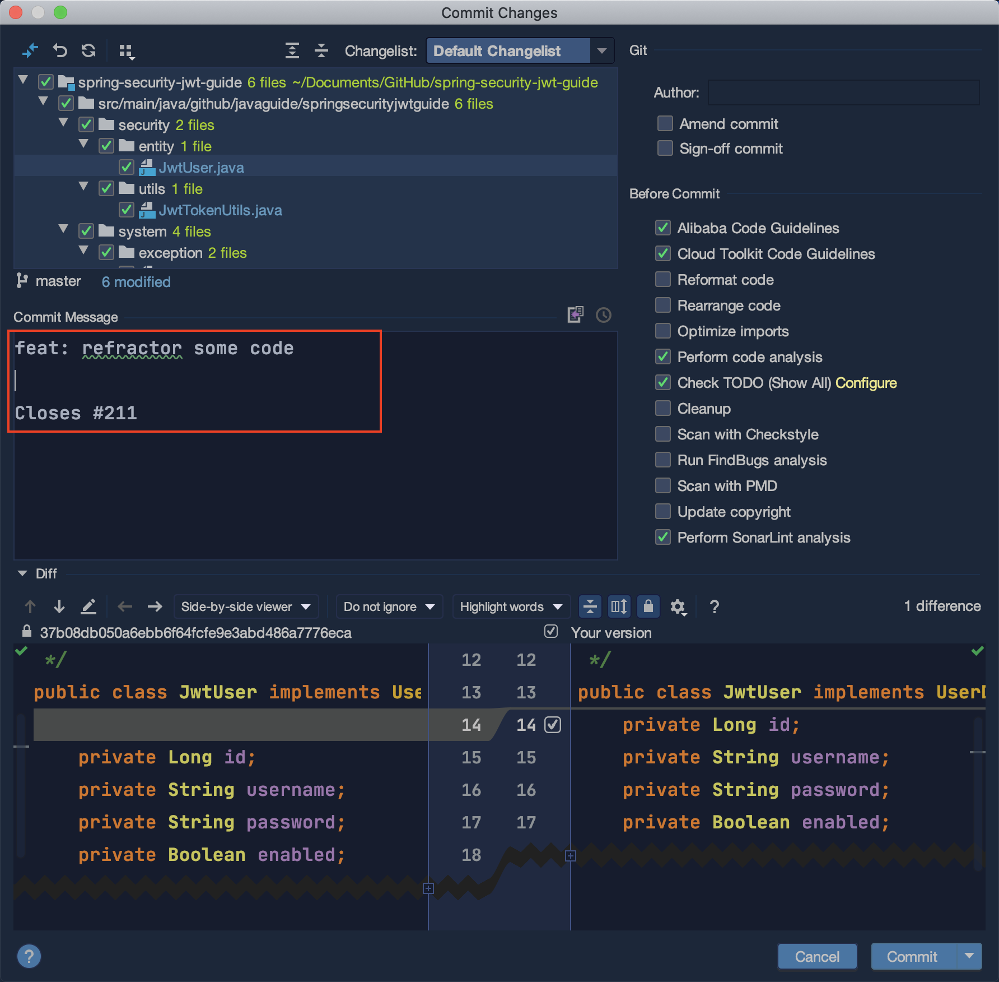

上一篇关于IDEA插件推荐的文章：[《第一弹！安排！安利10个让你爽到爆的IDEA必备插件！》](https://mp.weixin.qq.com/s?__biz=Mzg2OTA0Njk0OA==&mid=2247486586&idx=1&sn=b745f0be1a5fc0160f43625e29df9029&chksm=cea243b1f9d5caa7200950063ae9e1691d3578d46c0b865c8220c8f1e02ed43cb4e586c2524c&token=801835724&lang=zh_CN#rd)收到了很多小伙伴的好评，时隔大半个月左右，第二弹IDEA插件总算来啦！

下面推荐的插件几乎都是我觉得实用IDEA必备的，不过可以根据自己的需要适当进行选择。另外 IDEA 自带的很多插件如果没有用到的话都可以关掉，这样可以提高IDEA的运行速度。

**目录：**

- [Grep Console:控制台输出处理](#grep-console%e6%8e%a7%e5%88%b6%e5%8f%b0%e8%be%93%e5%87%ba%e5%a4%84%e7%90%86)
- [Rainbow Brackets:彩虹🌈括号](#rainbow-brackets%e5%bd%a9%e8%99%b9%f0%9f%8c%88%e6%8b%ac%e5%8f%b7)
- [Save Actions:优化保存操作](#save-actions%e4%bc%98%e5%8c%96%e4%bf%9d%e5%ad%98%e6%93%8d%e4%bd%9c)
- [SequenceDiagram:一键生成时序图](#sequencediagram%e4%b8%80%e9%94%ae%e7%94%9f%e6%88%90%e6%97%b6%e5%ba%8f%e5%9b%be)
- [Maven Helper:分析Maven项目的相关依赖](#maven-helper%e5%88%86%e6%9e%90maven%e9%a1%b9%e7%9b%ae%e7%9a%84%e7%9b%b8%e5%85%b3%e4%be%9d%e8%b5%96)
- [EasyCode:一键帮你生成所需代码](#easycode%e4%b8%80%e9%94%ae%e5%b8%ae%e4%bd%a0%e7%94%9f%e6%88%90%e6%89%80%e9%9c%80%e4%bb%a3%e7%a0%81)
- [CheckStyle:代码格式检查](#checkstyle%e4%bb%a3%e7%a0%81%e6%a0%bc%e5%bc%8f%e6%a3%80%e6%9f%a5)
- [SonarLint:帮你优化代码](#sonarlint%e5%b8%ae%e4%bd%a0%e4%bc%98%e5%8c%96%e4%bb%a3%e7%a0%81)
- [Lombok:帮你简化代码](#lombok%e5%b8%ae%e4%bd%a0%e7%ae%80%e5%8c%96%e4%bb%a3%e7%a0%81)
- [CodeGlance:代码微型地图](#codeglance%e4%bb%a3%e7%a0%81%e5%be%ae%e5%9e%8b%e5%9c%b0%e5%9b%be)
- [Java Stream Debugger:Java8 Stream调试器](#java-stream-debuggerjava8-stream%e8%b0%83%e8%af%95%e5%99%a8)
- [Git Commit Template:使用模板创建commit信息](#git-commit-template%e4%bd%bf%e7%94%a8%e6%a8%a1%e6%9d%bf%e5%88%9b%e5%bb%bacommit%e4%bf%a1%e6%81%af)
- [其他常用插件推荐](#%e5%85%b6%e4%bb%96%e5%b8%b8%e7%94%a8%e6%8f%92%e4%bb%b6%e6%8e%a8%e8%8d%90)

### Grep Console:控制台输出处理

可以说是必备的一个IDEA插件，非常实用！

这个插件主要的功能有两个：

**1. 自定义设置控制台输出颜色**

我们可以在设置中进行相关的配置:


配置完成之后的 log warn 的效果对比图如下：


**2. 过滤控制台输出**


### Rainbow Brackets:彩虹🌈括号

使用各种鲜明的颜色来展示你的括号，效果图如下。可以看出代码层级变得更加清晰了，可以说非常实用友好了！


### Save Actions:优化保存操作

真必备插件！可以帮助我们在保存文件的时候：

1. 优化导入；
2. 格式化代码；
3. 执行一些quick fix
4. ......

这个插件是支持可配置的，我的配置如下：



实际使用效果如下：




### SequenceDiagram:一键生成时序图

同样是一个必备的一个IDEA插件，非常实用。我一般用它来生成简单的方法时序图，方便我们阅读代码，特别是在代码的调用层级比较多的时候。

使用方法很简单，选中方法名（注意不要选类名），然后点击鼠标右键，选择 **Sequence Diagram** 选项即可！



配置完一些基本的选项比如调用深度之后，我们点击ok即可！在上面这张图中我们已经生成了调用方法之间的时序图。



时序图生成完成之后，你可以选择导出为图片或者text文件，你还可以通过生成的时序图来定位到相关的代码，这对于我们阅读源码的时候尤其有帮助！

### Maven Helper:分析Maven项目的相关依赖

主要用来分析Maven项目的相关依赖，可以帮助我们解决Maven依赖冲突问题。


**何为依赖冲突？**

说白了就是你的项目使用的2个jar包引用了同一个依赖h，并且h的版本还不一样,这个时候你的项目就存在两个不同版本的 h。这时Maven会依据依赖路径最短优先原则，来决定使用哪个版本的Jar包，而另一个无用的Jar包则未被使用，这就是所谓的依赖冲突。

大部分情况下，依赖冲突可能并不会对系统造成什么异常，因为Maven始终选择了一个Jar包来使用。但是，不排除在某些特定条件下，会出现类似找不到类的异常，所以，只要存在依赖冲突，在我看来，最好还是解决掉，不要给系统留下隐患。

### EasyCode:一键帮你生成所需代码

Easycode 可以直接对数据的表生成entity、controller、service、dao、mapper无需任何编码，简单而强大。



更多内容可以查看这篇文章：[《懒人 IDEA 插件插件:EasyCode 一键帮你生成所需代码~》](https://mp.weixin.qq.com/s?__biz=Mzg2OTA0Njk0OA==&mid=2247486205&idx=1&sn=0ff2f87f0d82a1bd9c0c44328ef69435&chksm=cea24536f9d5cc20c6cc7669f0d4167d747fe8b8c05a64546c0162d694aa96044a2862e24b57&token=1862674725&lang=zh_CN#rd)

### CheckStyle:代码格式检查

这个插件的作用主要是为了规范代码格式比如说项目中一行代码最长是多少、项目中有没有无用的引用等等。非常实用！

一般情况下我们会在项目中配置 CheckStyle，并且自定义规则，然后再配置一个Commit 的 Git 钩子，这样我们在Commit代码的时候就会跑一遍 CheckStyle，看看项目代码的格式有问题不。

这个插件的作用主要是帮助我们定位问题，示例如下：

我们使用一个自定义的规则，然后运行 CheckStyle  ，可以看到这个插件就帮我们找到有一个无用的 import。


### SonarLint:帮你优化代码

SonarLint 帮助你发现代码的错误和漏洞，就像是代码拼写检查器一样，SonarLint 可以实时显示出代码的问题，并提供清晰的修复指导，以便你提交代码之前就可以解决它们。



并且，很多项目都集成了 SonarQube,SonarLint 可以很方便地与 SonarQube 集成。

### Lombok:帮你简化代码

之前没有推荐这个插件的原因是觉得已经是人手必备的了。如果你要使用 Lombok 的话，不光是要安装这个插件，你的项目也要引入相关的依赖。

```xml
        <dependency>
            <groupId>org.projectlombok</groupId>
            <artifactId>lombok</artifactId>
            <optional>true</optional>
        </dependency>
```

使用 Lombok 能够帮助我们少写很多代码比如 Getter/Setter、Constructor等等。

关于Lombok的使用，可以查看这篇文章：[《十分钟搞懂Java效率工具Lombok使用与原理》](https://mp.weixin.qq.com/s?__biz=Mzg2OTA0Njk0OA==&mid=2247485385&idx=2&sn=a7c3fb4485ffd8c019e5541e9b1580cd&chksm=cea24802f9d5c1144eee0da52cfc0cc5e8ee3590990de3bb642df4d4b2a8cd07f12dd54947b9&token=1667678311&lang=zh_CN#rd)。

### CodeGlance:代码微型地图

提供一个代码的微型地图，当你的类比较多的时候可以帮忙你快速定位到要去的位置。这个插件在我们日常做普通开发的时候用处不大，不过，在你阅读源码的时候还是很有用的，如下图所示：


### Java Stream Debugger:Java8 Stream调试器

Stream API 让你的代码更加优雅，但是有一个缺点是代码更难阅读和理解，没关系，这个插件应该可以帮助到你！



### Git Commit Template:使用模板创建commit信息

没有安装这个插件之前，我们使用IDEA提供的Commit功能提交代码是下面这样的：

 

使用了这个插件之后是下面这样的，提供了一个commit信息模板的输入框：

 

完成之后的效果是这样的：

 

### 其他常用插件推荐

1. **leetcode editor** :提供在线 Leetcode 刷题功能，比较方便我们刷题，不过我试用之后发现有一些小 bug，个人感觉还是直接在网站找题目刷来的痛快一些。
3. **​A Search with Github** ：直接通过 Github搜索相关代码。
4. **stackoverflow** : 选中相关内容后单击右键即可快速跳转到 stackoverflow 。
5. **CodeStream** ：让code review变得更加容易。
6. **Code screenshots** ：代码片段保存为图片。
7. **activate-power-mode** :  写代码的时候自带动画效果！
8. **GitToolBox** :Git工具箱
9. **OK,​ Gradle!** ：搜索Java库用于Gradle项目
10. ......


