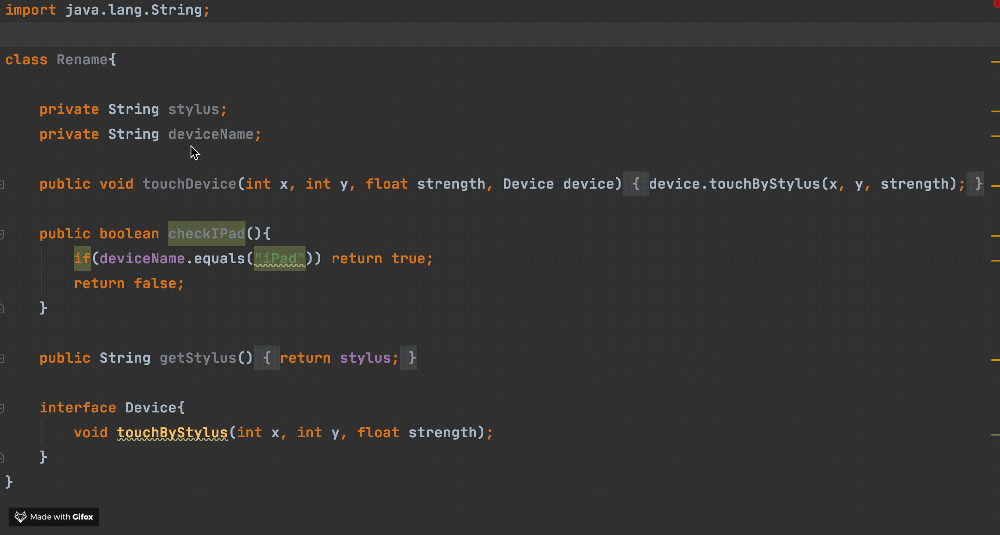
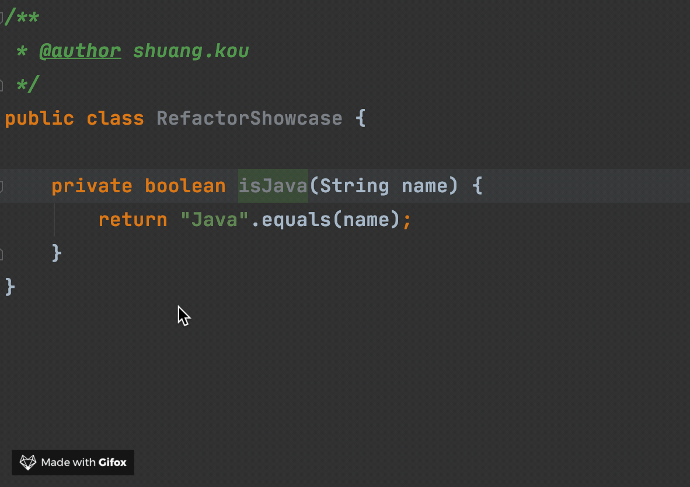
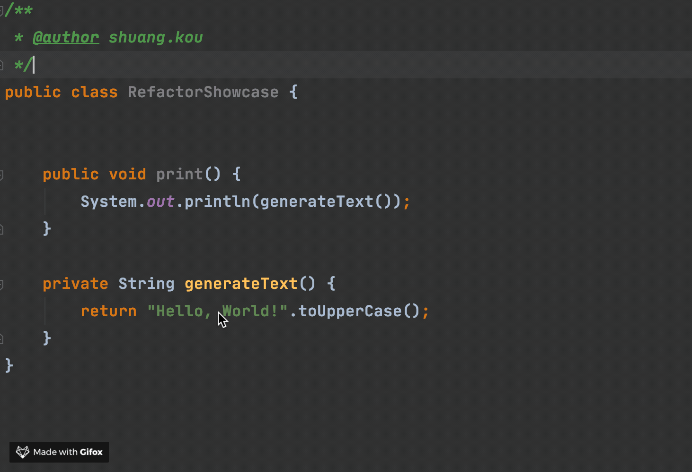
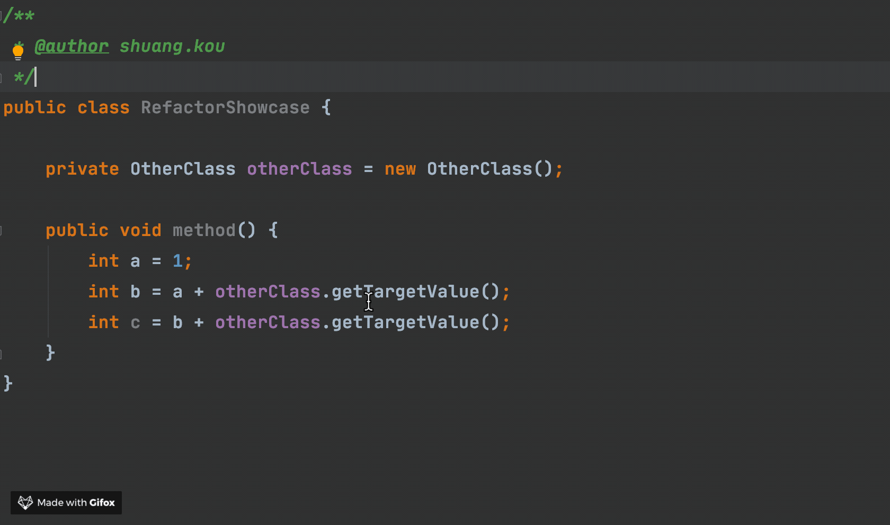
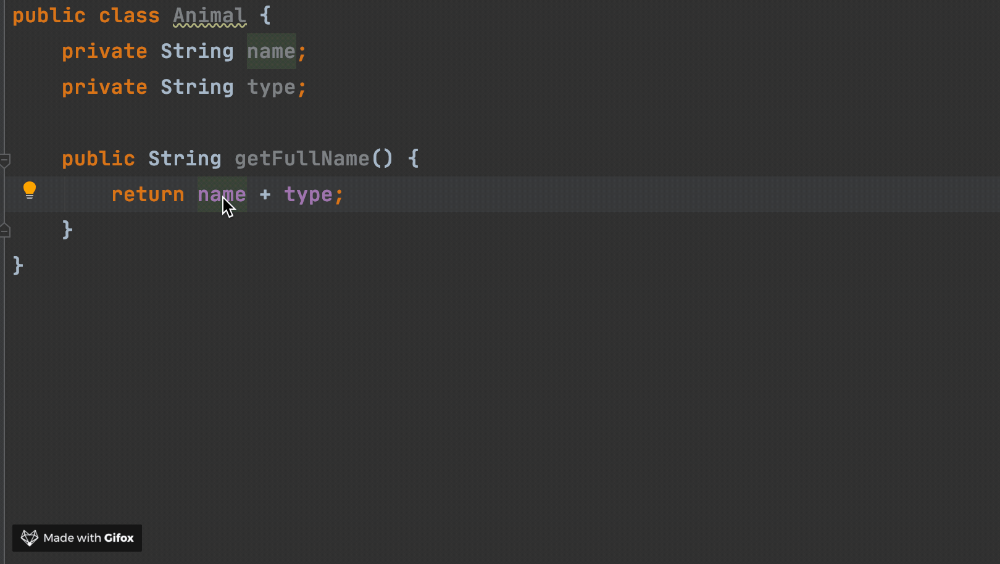
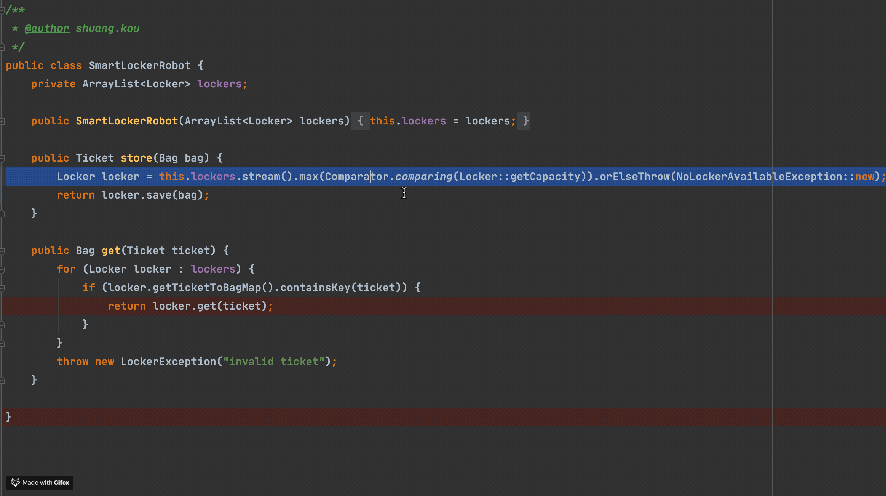
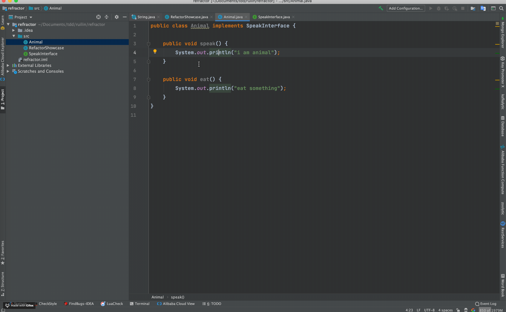

备选标题：项目组技术总监：都用IDEA这么久了还不会重构？你可以走人了!

IDEA 为重构代码提供了很好的支持。相关阅读：

1. https://www.yasinshaw.com/articles/18
2. https://www.jetbrains.com/help/idea/encapsulate-fields.html?keymap=secondary_macos

**F6:** 移动类或者方法的位置

**CMD + Alt + M(mac) / Ctrl + Alt + M(windows/Linux)：** 抽取方法

**CMD + Alt + F(mac) / Ctrl + Alt + F(windows/Linux)：** 抽取字段

**CMD + Alt + P(mac) / Ctrl + Alt + P(windows/Linux)：** 抽取参数

**CMD + Alt + N(mac) / Ctrl + Alt + N(windows/Linux)：** 内联

[TOC]

## 何为重构？

## 为什么要重构？

## 使用IDEA进行重构

我们在使用 IDEA 进行重构之前，先介绍一个方便我们进行重构的快捷键：`ctrl+t(mac)/ctrl+shift+alt+t`（如果忘记快捷键的话，鼠标右键也能找到重构选项），使用这个快捷键可以快速调出常用重构的选项，如下图所示：

### 重命名(rename)

快捷键：**Shift + F6(mac) / Shift + F6(windows/Linux)：** 对类、变量或者方法名重命名。

### 提取相关重构手段

这部分的快捷键实际很好记忆，我是这样记忆的:

前面两个键位是  `command + option(mac) / ctrl + alt (Windows/Linux)` 是固定的，只有后面一个键位会变比如Extract constant (提取变量)就是 c（constant）、Extract variable (提取变量)就是 v(variable)。

#### 提取常量(extract constant)

1. **使用场景** ：提取未经过定义就直接出现的常量。提取常量使得你的编码更易读，避免硬编码。
2. **快捷键：**  `command + option+ c(mac)/ ctrl + alt + c(Windows/Linux)`

**示例：**

#### 提取参数(exact parameter)

1. **使用场景** ：提取参数到方法中。
2. **快捷键：**  `command + option+ p(mac)/ ctrl + alt + p(Windows/Linux)`

#### 提取变量(exact variable)

1. **使用场景** ：提取多次出现的表达式。
2. **快捷键：** `command + option+ v(mac) / ctrl + alt + v(Windows/Linux) `

**示例：**

#### 提取属性(exact field)

1. **使用场景** ：把当前表达式提取成为类的一个属性。
2. **快捷键：** `command + option+ f(mac) / ctrl + alt + f(Windows/Linux) `

**示例：**

**示例：**

#### 提取方法(exact method)

1. **使用场景** ：1个或者多个表达式可以提取为一个方法。 提取方法也能使得你的编码更易读，更加语义化。
2. **快捷键：**  `command + option+ m(mac)/ ctrl + alt + m(Windows/Linux)`

**示例：**

#### 提取接口(exact interface)

1. **使用场景** ：想要把一个类中的1个或多个方法提取到一个接口中的时候。
2. **快捷键：**  `command + option+ m(mac)/ ctrl + alt + m(Windows/Linux)`

**示例：**

